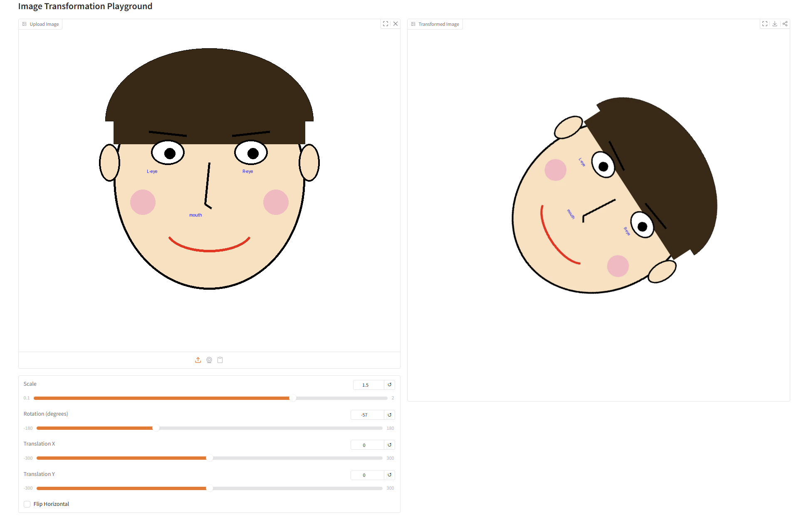
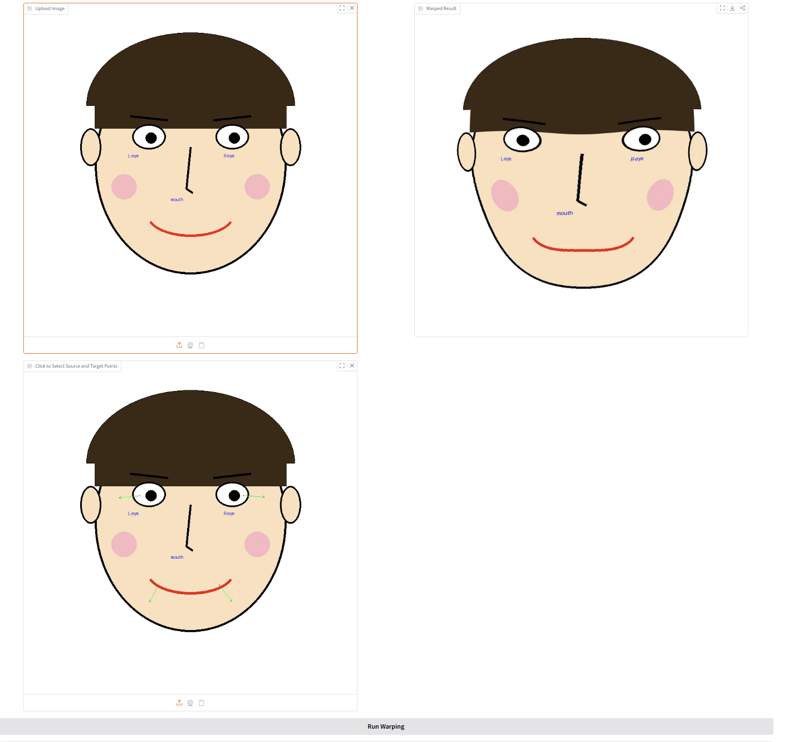
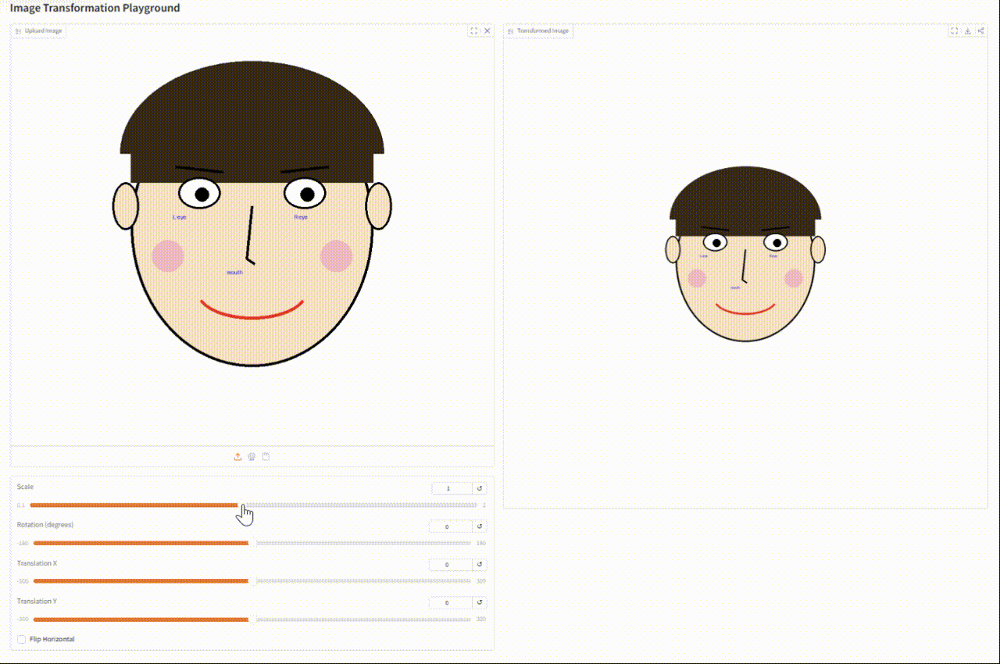
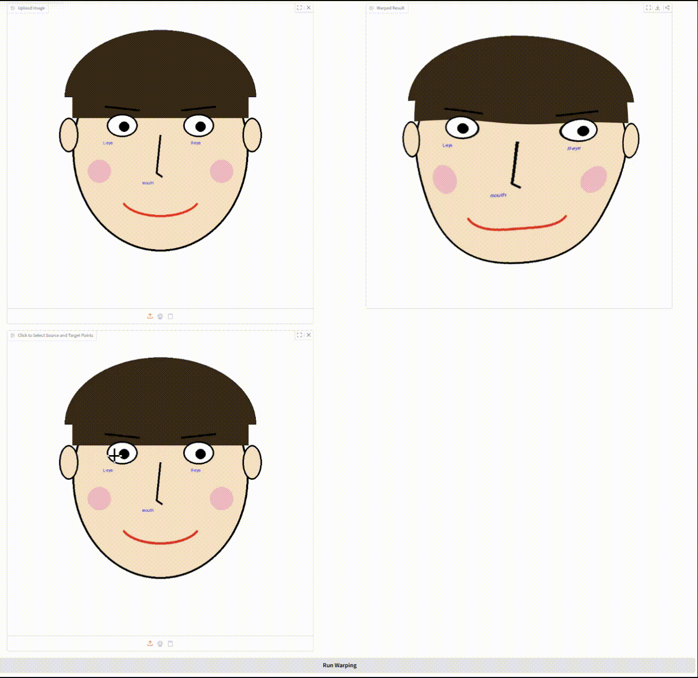

# Assignment 1 - Image Warping

## Digital Image Processing Course Assignment

This repository contains **Liu Feiyang (SA25001039)**'s implementation of **Assignment 1** for the **Digital Image Processing (DIP)** course.

The goal of this assignment is to understand and implement two representative image warping tasks:

1. **Basic Image Geometric Transformation**
2. **Point-Guided Image Deformation**

This project uses **Gradio** to provide an interactive interface, so that the transformation and deformation results can be directly observed in the browser.

---

##  Completed Tasks

In this assignment, I completed the following two tasks.

### Task 1: Basic Image Geometric Transformation



In this task, I implemented global geometric transformation on an input image, including:

- scaling
- rotation
- translation
- horizontal flipping

The transformation is controlled by interactive parameters, and scaling and rotation are implemented around the image center.

### Task 2: Point-Guided Image Deformation



In this task, I implemented interactive point-guided image warping.

The user first uploads an image, then selects multiple pairs of control points:

- one **source point**
- one corresponding **target point**

The image is then locally deformed according to these point correspondences, producing non-rigid warping effects.

---


## Requirements

To install requirements:

```setup
python -m pip install -r requirements.txt
```


## Running

To run basic transformation, run:

```basic
python run_global_transform.py
```

To run point guided transformation, run:

```point
python run_point_transform.py
```
##  Input and Output

###  Basic Image Geometric Transformation

**Input**
- an uploaded input image
- scale factor
- rotation angle
- translation along x-axis
- translation along y-axis
- whether to apply horizontal flipping

**Output**
- the transformed image after composing all selected geometric operations

###  Point-Guided Image Deformation

**Input**
- an uploaded input image
- multiple pairs of source and target control points

**Output**
- the warped image after local deformation guided by the selected control points

## Results 
### Basic Transformation


### Point Guided Deformation:


## Acknowledgement

>📋 Thanks for the algorithms proposed by [Image Deformation Using Moving Least Squares](https://people.engr.tamu.edu/schaefer/research/mls.pdf).

This work was completed with reference to the following materials:

- Schaefer, S., McPhail, T., and Warren, J., “Image Deformation Using Moving Least Squares,” *ACM Transactions on Graphics*, vol. 25, no. 3, pp. 533–540, 2006. [Online]. Available: https://people.engr.tamu.edu/schaefer/research/mls.pdf
- OpenCV Documentation, “Geometric Image Transformations.” [Online]. Available: https://docs.opencv.org/
- OpenCV Documentation, “warpAffine” and “remap.” [Online]. Available: https://docs.opencv.org/
- Gradio Documentation, “Interactive Web Interfaces for Image Processing Applications.” [Online]. Available: https://www.gradio.app/docs/
