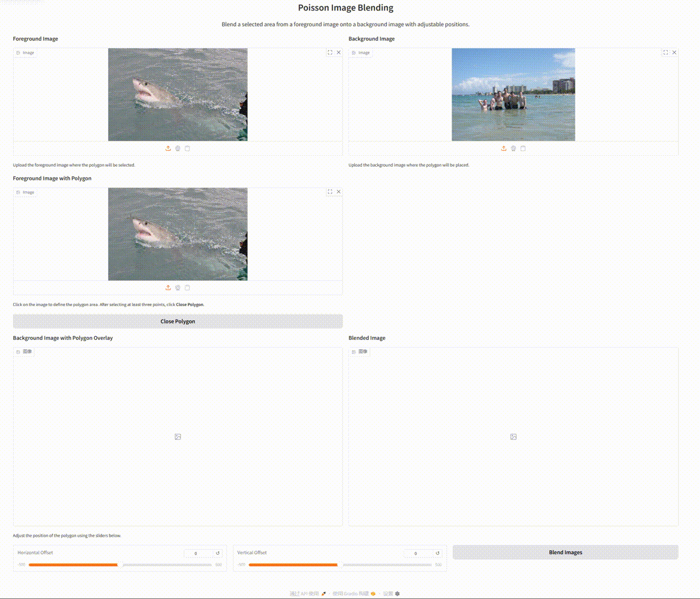
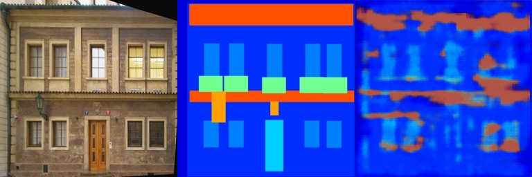
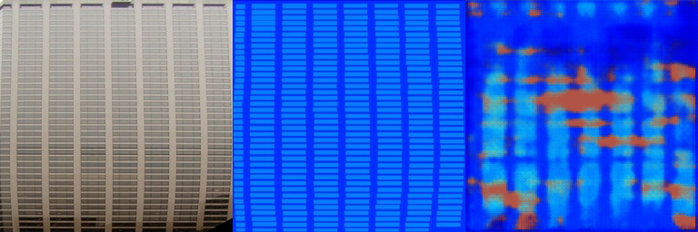

# Assignment 2 - DIP with PyTorch

## Digital Image Processing Course Assignment

This repository contains **Liu Feiyang (SA25001039)**'s implementation of **Assignment 2** for the **Digital Image Processing (DIP)** course.

The goal of this assignment is to understand and implement both traditional and deep learning-based DIP methods with PyTorch. In this assignment, I completed two representative tasks:

1. **Poisson Image Editing**
2. **Pix2Pix**

The first task focuses on gradient-domain image blending, while the second task uses a fully convolutional network to learn an image-to-image mapping on the Facades dataset.

---

## Completed Work

In this assignment, I completed the implementation and experiments for the following two parts.

For the **Poisson Image Editing** part, I completed the missing functions in the provided interactive framework. More specifically, I implemented the conversion from polygon points to a binary mask and the Laplacian-based loss computation used for optimization inside the masked region. The user can manually select a region from the foreground image, move it to a target position on the background image, and generate a blended result. Compared with directly copying and pasting the selected object, this method produces smoother boundary transitions and better visual consistency.

For the **Pix2Pix / FCN image translation** part, I completed the fully convolutional encoder-decoder network in `FCN_network.py` and trained it on the Facades dataset. The input image and target image are obtained by splitting each paired image into two halves. During training, the model learns the mapping from the input half to the target half under L1 loss supervision. The generated results are saved as three-part comparison images including the input image, the ground truth target image, and the model output image.

---

## Repository Structure

The repository is organized as follows:

```text
Assignment_02/
├─ README.md
├─ run_blending_gradio.py
├─ data_possion/
│  ├─ equation/
│  │  ├─ source.png
│  │  └─ target.png
│  ├─ monolisa/
│  │  ├─ source.png
│  │  └─ target.png
│  └─ water/
│     ├─ source.png
│     └─ target.png
└─ Pix2Pix/
   ├─ FCN_network.py
   ├─ train.py
   ├─ facades_dataset.py
   └─ download_facades_dataset.sh
```

The folder `data_possion` is used for Poisson Image Editing examples.

Each subfolder contains:

- `source.png`: the foreground image used for region selection
- `target.png`: the background image used for blending


---

## Environment Setup

It is recommended to use a **conda environment**.

### Create environment

```bash
conda create -n pytorch python=3.10
conda activate pytorch
```

### Install dependencies

```bash
pip install torch torchvision numpy pillow gradio opencv-python
```

If `cv2` is missing when running `train.py`, install OpenCV with:

```bash
pip install opencv-python
```

### Windows Notes

On Windows, it is recommended to use **PowerShell** or **Anaconda Prompt**.

If the shell script `download_facades_dataset.sh` cannot be executed directly, please use the PowerShell commands provided below to download and prepare the Facades dataset manually.

---

## Dataset Preparation

### Poisson Image Editing Data

The Poisson Image Editing examples are stored in the `data_possion` folder. Three example cases are included:

- `equation`
- `monolisa`
- `water`

Each case contains a foreground image and a background image for interactive blending.

### Pix2Pix Dataset

The **Facades dataset** is **not included** in this repository.

#### Linux / macOS

You can download the dataset by running:

```bash
bash Pix2Pix/download_facades_dataset.sh
```

#### Windows

If `bash download_facades_dataset.sh` does not work in PowerShell, use the following commands instead:

```powershell
New-Item -ItemType Directory -Force -Path .\Pix2Pix\datasets | Out-Null
Invoke-WebRequest -Uri "http://efrosgans.eecs.berkeley.edu/pix2pix/datasets/facades.tar.gz" -OutFile ".\Pix2Pix\datasets\facades.tar.gz"
tar -xzf .\Pix2Pix\datasets\facades.tar.gz -C .\Pix2Pix\datasets\
Remove-Item .\Pix2Pix\datasets\facades.tar.gz
Get-ChildItem .\Pix2Pix\datasets\facades\train -Filter *.jpg -Recurse | Sort-Object FullName | ForEach-Object { $_.FullName } | Set-Content .\Pix2Pix\train_list.txt
Get-ChildItem .\Pix2Pix\datasets\facades\val -Filter *.jpg -Recurse | Sort-Object FullName | ForEach-Object { $_.FullName } | Set-Content .\Pix2Pix\val_list.txt
```

After that, `train_list.txt` and `val_list.txt` will be generated automatically, and the training script can read the dataset correctly.

---

## Running

### Poisson Image Editing

To launch the interactive blending interface:

```bash
python run_blending_gradio.py
```

### Pix2Pix / FCN Image Translation

To train the model:

```bash
cd Pix2Pix
python train.py
```

---

## Input and Output

### Poisson Image Editing

**Input**
- a foreground image
- a background image
- polygon points selected on the foreground image
- horizontal and vertical offsets for positioning the selected region

**Output**
- a blended image in which the selected foreground region is fused into the background image

### Pix2Pix / FCN Translation

**Input**
- paired images from the Facades dataset
- one half of each image used as the model input
- the other half used as the target image

**Output**
- the generated target image predicted by the network
- saved comparison images containing:
  - input image
  - ground truth target image
  - model output image

---

## Method Description

This assignment contains two different DIP methods.

For the **Poisson Image Editing** part, the selected polygon is first converted into a binary mask. The foreground mask and the shifted target mask determine the source region and the target region. Instead of directly forcing the output image to copy the source pixel values, the method minimizes the difference between the Laplacian responses of the source image and the blended image inside the masked region. This allows the local gradient structure of the selected object to be preserved more naturally.

For the **Pix2Pix / FCN translation** part, a fully convolutional encoder-decoder network is used. The encoder downsamples the input image and extracts features through convolutional layers, while the decoder reconstructs the output through transposed convolution layers. The final layer uses `Tanh`, which matches the normalized image range `[-1, 1]` used in the dataset preprocessing. The training objective is the L1 loss between the generated image and the target image. Although this part is placed in the `Pix2Pix` folder, the provided training framework is essentially a supervised FCN-based image translation model without an adversarial discriminator.

---

## Results

### Poisson Image Editing



The Poisson blending results show that the selected foreground object can be transferred to the target background region with smoother transitions than direct copy-paste. The optimization based on Laplacian loss helps reduce obvious boundary artifacts and improves visual compatibility between the source object and the target background.

### Pix2Pix / FCN Translation




The image translation results are saved as three-part comparison images including the input image, the ground truth target image, and the generated output image. From the validation results, the model is able to capture the major structure of the target image and learn the approximate layout of semantic regions. However, the output is still somewhat blurry in local details, which is consistent with the use of a fully convolutional network trained only with L1 loss.

---

## Discussion

This assignment helped me understand both a traditional gradient-domain image editing method and a neural network-based image translation method within the same PyTorch framework.

For **Poisson Image Editing**, the most important steps are correct mask generation and proper Laplacian loss computation inside the masked region. Once these parts are implemented correctly, the blending result becomes much more natural than direct pasting.

For the **image translation** task, the experiment shows that an FCN-based encoder-decoder can already learn coarse structure and major image regions from paired data. However, without an adversarial discriminator, the generated output is still relatively smooth and lacks sharp local details. This also illustrates the difference between a basic supervised image mapping model and a complete Pix2Pix framework.

Overall, this assignment gave me a clearer understanding of how traditional DIP methods and deep learning-based DIP methods solve image transformation problems from two different perspectives.

---

## Acknowledgement

This work was completed with reference to the following materials:

- Pérez, P., Gangnet, M., and Blake, A., “Poisson Image Editing,” *ACM Transactions on Graphics*, 2003.
- Isola, P., Zhu, J.-Y., Zhou, T., and Efros, A. A., “Image-to-Image Translation with Conditional Adversarial Nets,” *CVPR*, 2017.
- Long, J., Shelhamer, E., and Darrell, T., “Fully Convolutional Networks for Semantic Segmentation,” *CVPR*, 2015.
- PyTorch Documentation: https://pytorch.org/
- OpenCV Documentation: https://docs.opencv.org/
- Gradio Documentation: https://www.gradio.app/
