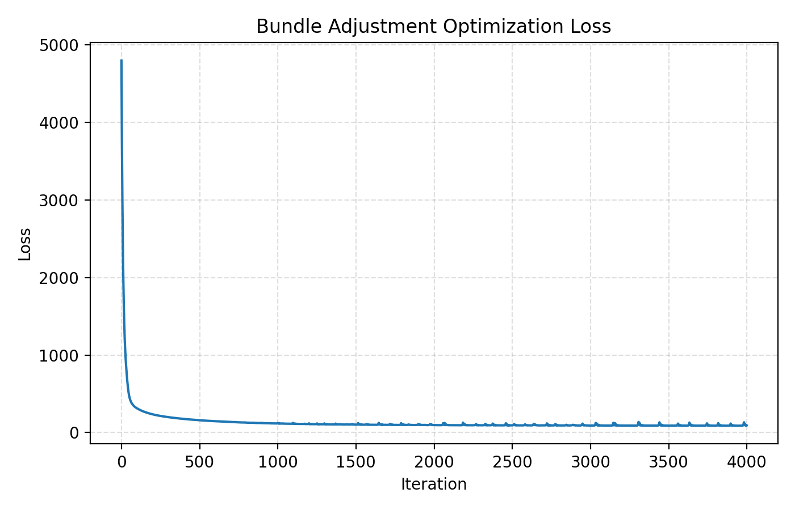
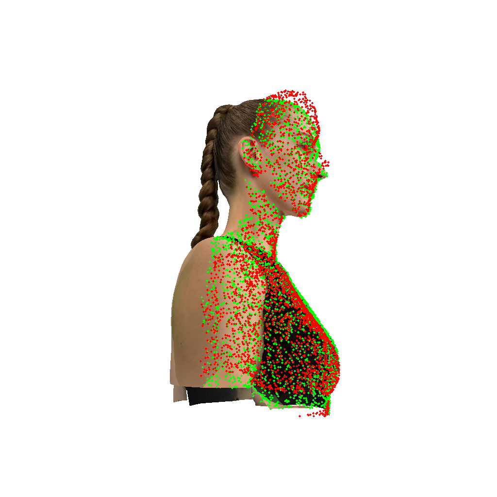
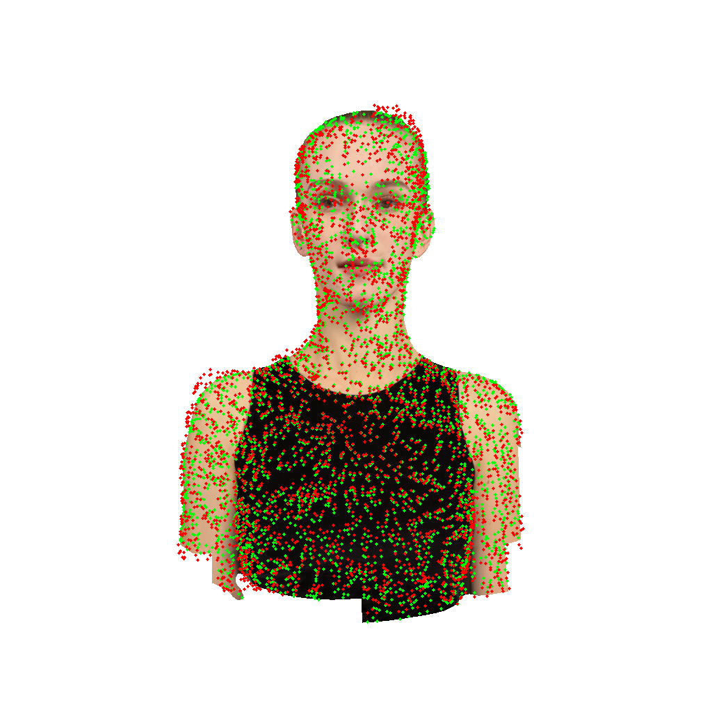
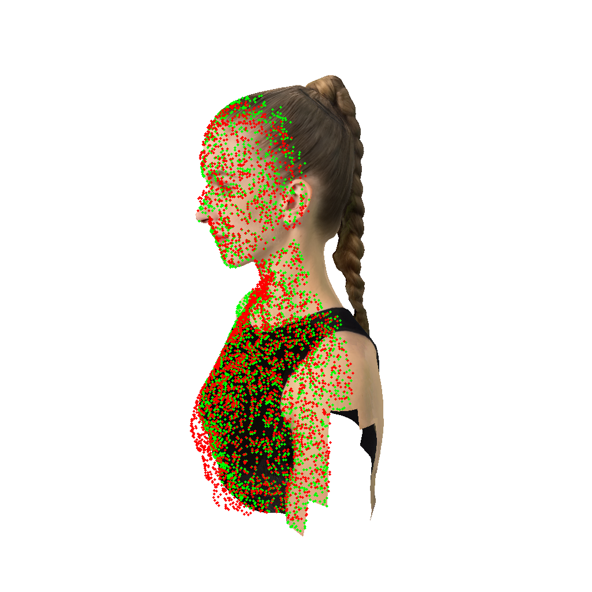
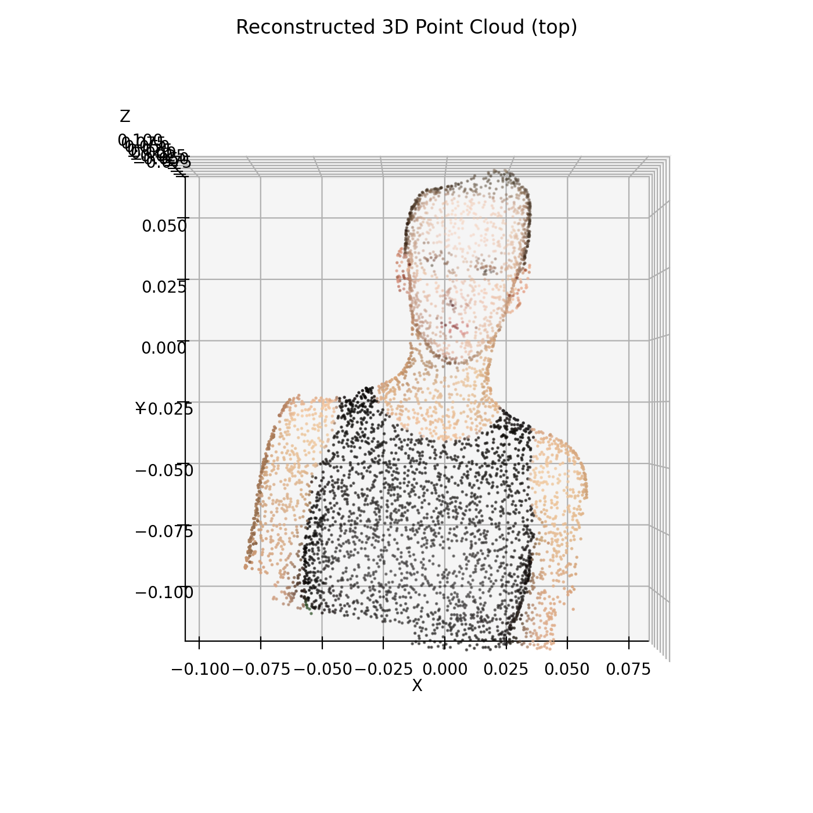
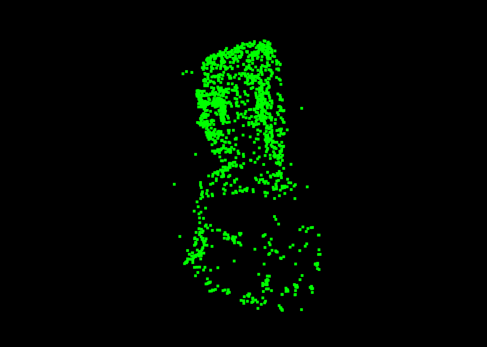
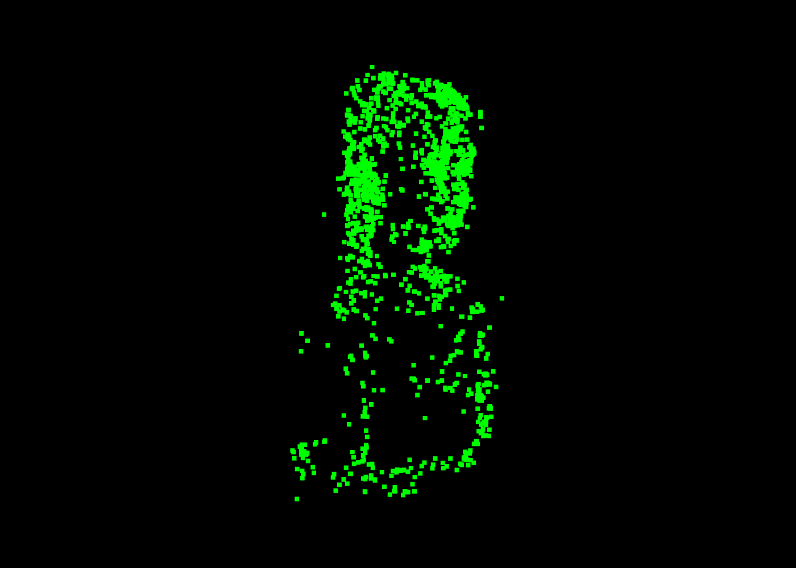
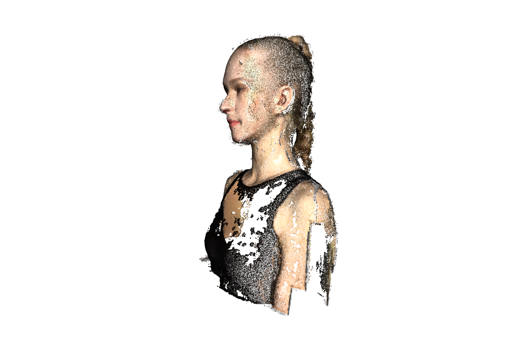
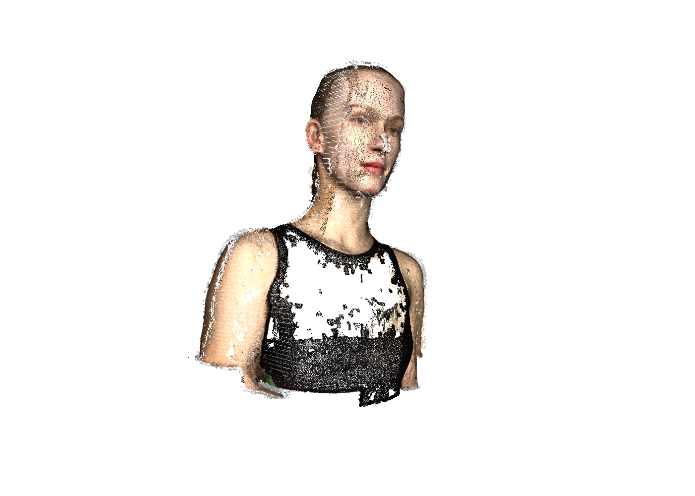

# Assignment 3 - Bundle Adjustment

## Digital Image Processing Course Assignment

This repository contains **Liu Feiyang (SA25001039)**'s implementation of **Assignment 3** for the **Digital Image Processing (DIP)** course.

In this assignment, I completed two tasks:

1. **Bundle Adjustment with PyTorch**
2. **3D Reconstruction with COLMAP**

The first task focuses on recovering the 3D structure, camera extrinsics, and shared focal length from multi-view 2D observations through optimization. The second task uses the COLMAP pipeline to perform full 3D reconstruction from rendered multi-view images.

---

## Repository Structure

```text
Assignment_03/
├─ README.md
├─ task1_bundle_adjustment.py
├─ run_colmap.sh
├─ visualize_data.py
├─ data/
│  ├─ images/
│  ├─ points2d.npz
│  ├─ points3d_colors.npy
│  └─ colmap/
│     ├─ database.db
│     ├─ sparse/
│     │  ├─ 0/
│     │  └─ sparse.ply
│     └─ dense/
│        └─ fused.ply
├─ outputs/
│  ├─ reconstructed.obj
│  └─ camera_params.npz
└─ figures/
   ├─ loss_curve.png
   ├─ point_cloud_view1.png
   ├─ point_cloud_view2.png
   ├─ point_cloud_front.png
   ├─ point_cloud_side.png
   ├─ point_cloud_top.png
   ├─ reprojection/
   │  ├─ view_000_reproj.png
   │  ├─ view_012_reproj.png
   │  ├─ view_025_reproj.png
   │  ├─ view_037_reproj.png
   │  └─ view_049_reproj.png
   └─ task2_views/
      ├─ back.png
      ├─ front.png
      ├─ front_left.png
      ├─ front_right.png
      ├─ left.png
      ├─ right.png
      ├─ top.png
      ├─ top_front_left.png
      ├─ top_front_right.png
      ├─ task2_sparse_front.png
      └─ task2_sparse_side.png
```

- `outputs/reconstructed.obj`: reconstructed colored point cloud from Task 1.
- `outputs/camera_params.npz`: optimized focal length and camera extrinsic parameters.
- `figures/loss_curve.png`: loss curve of the bundle adjustment optimization.
- `figures/point_cloud_*.png`: Task 1 reconstructed 3D point cloud under different viewpoints.
- `figures/reprojection/*.png`: reprojection comparison figures for Task 1.
- `data/colmap/sparse/sparse.ply`: sparse reconstruction result exported from COLMAP.
- `data/colmap/dense/fused.ply`: dense reconstruction result from COLMAP.
- `figures/task2_views/*.png`: Task 2 visualization screenshots captured from different viewpoints.
---

## Environment Setup

It is recommended to use a **conda environment**.

### Create environment

```bash
conda create -n dip python=3.10
conda activate dip
```

### Install Python dependencies

```bash
pip install numpy matplotlib opencv-python torch torchvision
```

If additional packages are needed, they can be installed manually.

---

## Task 1: Bundle Adjustment with PyTorch

### 1. Task Description

In this task, I implemented **Bundle Adjustment** from scratch using PyTorch. The goal is to recover:

- the shared focal length \(f\),
- the extrinsic parameters \((R, T)\) for all 50 cameras,
- and the 3D coordinates of all sampled points,

from the provided 2D observations stored in `points2d.npz`.

The optimization is based on minimizing the **2D reprojection error** between the predicted image points and the observed image points.

---

### 2. Data Description

The following files are used in Task 1:

- `data/points2d.npz`: multi-view 2D observations. Each view contains an array of shape `(20000, 3)`, where each row is `(x, y, visibility)`.
- `data/points3d_colors.npy`: RGB colors of the 3D points, used to export the final colored point cloud.
- `data/images/`: rendered images for visualization and reprojection comparison.

The 2D observations are used for optimization, while the color file is used only for the final point cloud export.

---

### 3. Method

I parameterized the optimization variables as follows:

- **Focal length**: a single shared scalar parameter for all views.
- **Camera rotations**: represented by Euler angles.
- **Camera translations**: optimized directly as 3D vectors.
- **3D points**: optimized directly as learnable coordinates.

For a 3D point `P = (X, Y, Z)`, the camera-space coordinates are computed by:

`[Xc, Yc, Zc]^T = R P + T`

According to the coordinate convention given in the assignment, the projection equations are:

`u = -f * Xc / Zc + cx`

`v =  f * Yc / Zc + cy`

where `cx = W / 2` and `cy = H / 2`.

The loss function is mainly the **reprojection error** between the predicted 2D points and the observed 2D points. Visibility masks are used so that only visible points contribute to the loss. To stabilize optimization, mild regularization terms are also added.

The optimization is performed with the **Adam** optimizer in PyTorch.

---

### 4. Running

To run Task 1:

```bash
python task1_bundle_adjustment.py
```

After optimization, the script saves:

- the loss curve,
- the reconstructed colored point cloud in `.obj` format,
- the optimized camera parameters,
- and several reprojection visualizations.

---

### 5. Input and Output

**Input**
- `points2d.npz`
- `points3d_colors.npy`
- rendered images in `data/images/` for visualization

**Output**
- optimized focal length
- optimized camera extrinsics
- optimized 3D point coordinates
- a colored OBJ point cloud
- loss curve
- reprojection visualizations

---

### 6. Results

#### 6.1 Optimization Loss



The optimization loss decreases rapidly at the beginning and then gradually converges, which shows that the bundle adjustment process is effective and numerically stable.

#### 6.2 Reprojection Visualization





In the reprojection figures, the **observed points** and the **predicted points** largely overlap with each other, indicating that the optimized 3D structure and camera parameters can explain the 2D observations reasonably well.

#### 6.3 Reconstructed 3D Point Cloud



The reconstructed point cloud captures the overall bust structure, including the head, neck, and upper body region. Although the global 3D shape is not perfectly ideal, the result is consistent with the reprojection alignment and demonstrates that the implemented bundle adjustment is able to recover a meaningful 3D structure.

#### 6.4 Final Quantitative Results

You may summarize the final results in a small table like this:

| Metric | Value |
|--------|-------|
| Final focal length | **12789.183594** |
| Final reprojection RMSE | **9.5451 pixels** |

---

### 7. Discussion

Task 1 shows that bundle adjustment can successfully reduce reprojection error and recover a meaningful 3D structure from multi-view 2D observations. The reprojection results are relatively good, which means that the optimized camera parameters and 3D points fit the observations well.

At the same time, the reconstructed 3D point cloud is not perfectly ideal in global shape. This is understandable because bundle adjustment mainly minimizes the 2D reprojection error, while the recovered 3D structure may still suffer from ambiguity or geometric degeneration without stronger geometric priors or regularization.

Overall, the PyTorch implementation successfully demonstrates the core idea of bundle adjustment.

---
## Task 2: 3D Reconstruction with COLMAP

### 1. Task Description

In this task, I used **COLMAP** to reconstruct the 3D scene from the multi-view rendered images stored in `data/images/`.

The complete COLMAP pipeline includes:

1. **Feature Extraction**
2. **Feature Matching**
3. **Sparse Reconstruction**
4. **Dense Reconstruction**
   - Image Undistortion
   - Patch Match Stereo
   - Stereo Fusion
5. **Result Visualization**

Compared with Task 1, where bundle adjustment was implemented manually in PyTorch, Task 2 focuses on using a mature reconstruction system to perform a full multi-view reconstruction pipeline.

---

### 2. Input and Output

**Input**
- Multi-view rendered images in `data/images/`

**Output**
- Sparse reconstruction model in `data/colmap/sparse/0/`
- Sparse point cloud converted to `.ply`
- Dense reconstruction result `data/colmap/dense/fused.ply`

---

### 3. How to Run the Provided `run_colmap.sh` on Windows

The repository provides a shell script `run_colmap.sh` for the COLMAP pipeline. However, on **Windows**, this script usually cannot be executed directly in PowerShell unless WSL or Git Bash is used. Therefore, I executed the same commands **step by step in PowerShell** using `COLMAP.bat`.

Before running the commands, I first installed the Windows pre-built version of COLMAP and verified the installation with:

```powershell
cd D:\COLMAP
.\COLMAP.bat -h
```

Then I entered the project directory:

```powershell
cd D:\DIP-Teaching-main\Assignments\03_BundleAdjustment
```

I also created the output folders in advance:

```powershell
New-Item -ItemType Directory -Force -Path .\data\colmap\sparse | Out-Null
New-Item -ItemType Directory -Force -Path .\data\colmap\dense | Out-Null
```

The original shell script was then converted into the following Windows PowerShell commands.

#### Step 1: Feature Extraction

```powershell
D:\COLMAP\COLMAP.bat feature_extractor `
    --database_path .\data\colmap\database.db `
    --image_path .\data\images `
    --ImageReader.camera_model PINHOLE `
    --ImageReader.single_camera 1
```

This step extracts local features from all images and stores them in `database.db`.

#### Step 2: Feature Matching

```powershell
D:\COLMAP\COLMAP.bat exhaustive_matcher `
    --database_path .\data\colmap\database.db
```

This step performs exhaustive matching between all image pairs.

#### Step 3: Sparse Reconstruction

```powershell
D:\COLMAP\COLMAP.bat mapper `
    --database_path .\data\colmap\database.db `
    --image_path .\data\images `
    --output_path .\data\colmap\sparse
```

This step estimates camera poses and reconstructs a sparse 3D point cloud.

#### Step 4: Convert Sparse Model to PLY

```powershell
D:\COLMAP\COLMAP.bat model_converter `
    --input_path .\data\colmap\sparse\0 `
    --output_path .\data\colmap\sparse\sparse.ply `
    --output_type PLY
```

This step converts the sparse reconstruction result to `.ply` format for easier visualization.

#### Step 5: Image Undistortion

```powershell
D:\COLMAP\COLMAP.bat image_undistorter `
    --image_path .\data\images `
    --input_path .\data\colmap\sparse\0 `
    --output_path .\data\colmap\dense `
    --output_type COLMAP `
    --max_image_size 2000
```

This step prepares the workspace for dense reconstruction.

#### Step 6: Patch Match Stereo

```powershell
D:\COLMAP\COLMAP.bat patch_match_stereo `
    --workspace_path .\data\colmap\dense `
    --workspace_format COLMAP `
    --PatchMatchStereo.geom_consistency true
```

This step estimates dense depth maps from multiple views.

#### Step 7: Stereo Fusion

```powershell
D:\COLMAP\COLMAP.bat stereo_fusion `
    --workspace_path .\data\colmap\dense `
    --workspace_format COLMAP `
    --input_type geometric `
    --output_path .\data\colmap\dense\fused.ply
```

This step fuses the dense depth estimation results into the final dense point cloud.

---

### 4. Result Visualization

For visualization, I converted the sparse model to `sparse.ply` and opened the resulting point clouds with **Open3D** for inspection and screenshot generation.

#### 4.1 Sparse Reconstruction Result




The sparse reconstruction result shows that COLMAP successfully recovered the camera poses and a reasonable sparse 3D point cloud from the rendered multi-view images. Although the number of points is limited, the overall structure can already be identified.

#### 4.2 Dense Reconstruction Result




The dense reconstruction result is much more complete than the sparse reconstruction. The point cloud is denser, the geometric structure is more continuous, and the overall visual quality is significantly improved.

---

### 5. Discussion

Task 2 demonstrates the complete reconstruction pipeline of COLMAP, from image features to sparse and dense 3D reconstruction.

From the results, the **sparse reconstruction** is sufficient to verify that camera poses and basic 3D geometry can be recovered successfully. The **dense reconstruction** further improves the completeness of the model and produces a more visually meaningful point cloud.

Compared with Task 1, Task 2 is more engineering-oriented. In Task 1, I manually optimized the camera parameters and 3D points using reprojection error in PyTorch, which helped me understand the mathematical formulation of bundle adjustment. In Task 2, COLMAP provided a complete practical reconstruction pipeline, including feature extraction, matching, sparse mapping, and dense fusion. Therefore, Task 2 gives a clearer view of how a real reconstruction system works in practice.

---

## Conclusion

In this assignment, I completed both a custom **Bundle Adjustment** implementation in PyTorch and a full **COLMAP-based 3D reconstruction** pipeline.

Task 1 helped me understand the mathematical structure of bundle adjustment, including camera projection, reprojection loss, and optimization of focal length, camera extrinsics, and 3D points. Task 2 showed how a full multi-view reconstruction system can be built on top of image matching, sparse mapping, and dense stereo fusion.

Overall, this assignment provided a useful comparison between optimization-based geometric reconstruction and a mature industrial reconstruction system.

---

## Acknowledgement

This work was completed with reference to the following materials:

- Bundle Adjustment — Wikipedia
- PyTorch Optimization Documentation
- COLMAP Documentation
- COLMAP Tutorial
- Open3D Documentation

In particular:

- **Task 1** was mainly based on PyTorch optimization and the bundle adjustment formulation introduced in the course materials.
- **Task 2** was completed with the help of the COLMAP command-line pipeline and Open3D for point cloud visualization.
