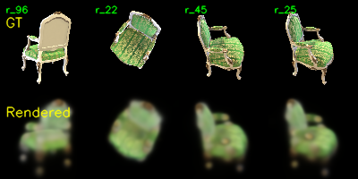
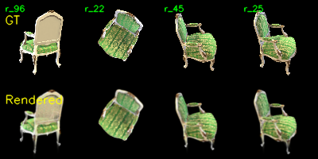
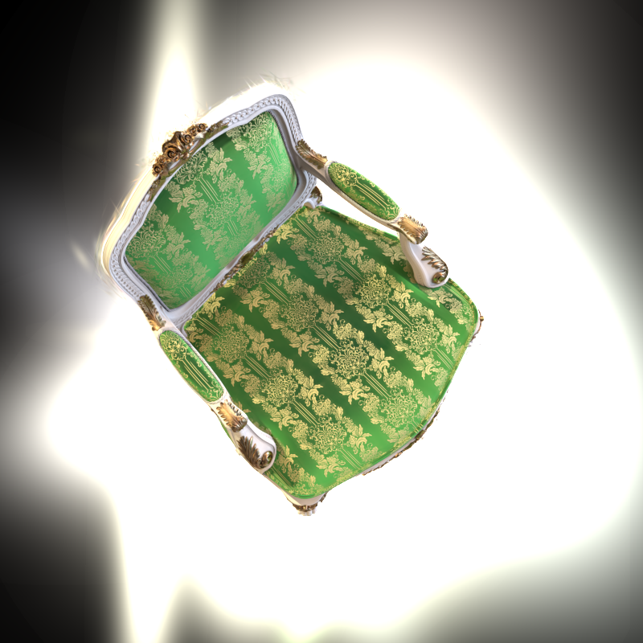
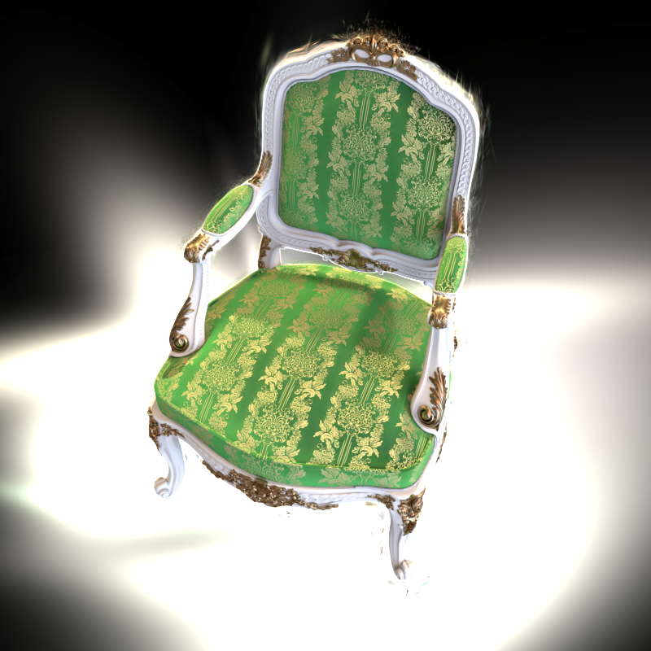

# Assignment 4 - Implement Simplified 3D Gaussian Splatting

## Digital Image Processing Course Assignment

This repository contains **Liu Feiyang (SA25001039)**'s implementation of **Assignment 4** for the **Digital Image Processing (DIP)** course.

In this assignment, I completed three tasks:

1. **Structure-from-Motion with COLMAP**
2. **Simplified 3D Gaussian Splatting**
3. **Comparison with the Official 3DGS Implementation**

The first task focuses on recovering camera parameters and sparse 3D points from multi-view images using COLMAP. The second task implements a simplified version of 3D Gaussian Splatting in pure PyTorch. The third task compares my implementation with the official 3DGS framework.

---

## Repository Structure

```text
Assignment_04/
├─ README.md
├─ gaussian_model.py
├─ gaussian_renderer.py
├─ train.py
├─ render_3dgs_mv.py
├─ mvs_with_colmap.py
├─ debug_mvs_by_projecting_pts.py
└─ figures/
   ├─ epoch_0000.png
   ├─ epoch_0100.png
   ├─ epoch_0199.png
   ├─ render_mv.mp4
   ├─ 00041.png
   ├─ 00062.png
   └─ 00099.png
```

* `gaussian_model.py`: Gaussian parameter initialization and covariance construction.
* `gaussian_renderer.py`: Gaussian projection, evaluation, and alpha blending rendering.
* `train.py`: training script for the simplified 3DGS model.
* `render_3dgs_mv.py`: multi-view rendering script after training.
* `mvs_with_colmap.py`: COLMAP pipeline script for sparse reconstruction.
* `debug_mvs_by_projecting_pts.py`: reprojection visualization for verifying COLMAP results.
* `figures/epoch_0000.png`, `epoch_0100.png`, `epoch_0199.png`: representative training results of the simplified implementation.
* `figures/render_mv.mp4`: final multi-view rendering video of the simplified implementation.
* `figures/00041.png`, `00062.png`, `00099.png`: representative rendering results from the official 3DGS implementation.

**Note:** The original `data/` folder is not uploaded to this repository because it contains a large number of files and takes substantial storage space. Only the key result figures and the video used in the report are included.

---

## Environment Setup

It is recommended to use a **conda environment**.

### Create environment

```bash
conda create -n dip python=3.10
conda activate dip
```

### Install Python dependencies

```bash
pip install numpy matplotlib opencv-python torch torchvision natsort iopath
```

If additional packages are needed, they can be installed manually.

For the official 3DGS implementation, the environment can be configured according to the official repository requirements.

---

## Task 1: Structure-from-Motion with COLMAP

### 1. Task Description

In this task, I used **COLMAP** to recover the camera intrinsics, camera poses, and sparse 3D points from the multi-view rendered images in `data/chair/images/`.

The recovered sparse points are used as the initialization of the Gaussian representation in the following simplified 3DGS stage.

---

### 2. Input and Output

**Input**

* Multi-view rendered images in `data/chair/images/`

**Output**

* Sparse reconstruction model in `data/chair/sparse/0/`
* Text-format sparse model in `data/chair/sparse/0_text/`
* Reprojection verification results generated by the debugging script

---

### 3. Method

The COLMAP pipeline includes the following main steps:

1. **Feature Extraction**
2. **Feature Matching**
3. **Sparse Reconstruction**
4. **Model Conversion**
5. **Reprojection Verification**

After sparse reconstruction, the recovered 3D points were projected back to the image plane for qualitative verification. This step helps check whether the recovered camera parameters and sparse geometry are consistent with the original observations.

---

### 4. Running

To run Task 1:

```bash
python mvs_with_colmap.py --data_dir data/chair
python debug_mvs_by_projecting_pts.py --data_dir data/chair
```

---

### 5. Results

The COLMAP pipeline successfully recovered the camera parameters and a sparse 3D structure of the chair scene. Although the sparse point cloud is not dense enough for direct rendering, it provides a reliable geometric prior for the Gaussian initialization in Task 2.

The reprojection verification also shows that the recovered sparse points are generally consistent with the image content, which indicates that the recovered geometry and camera poses are reasonable.

---

### 6. Discussion

Task 1 provides the geometric foundation for the whole assignment. The sparse reconstruction result is not intended for high-quality rendering by itself, but it is sufficient to initialize the Gaussian positions and colors in the simplified 3DGS model.

---

## Task 2: Simplified 3D Gaussian Splatting

### 1. Task Description

In this task, I implemented a simplified version of **3D Gaussian Splatting (3DGS)** in pure PyTorch. Starting from the sparse COLMAP points, each point is represented as a learnable Gaussian primitive, and the whole scene is rendered differentiably through Gaussian projection and alpha blending.

Compared with the official 3DGS framework, this simplified implementation does not include more advanced engineering components such as optimized tile-based rasterization or adaptive densification. However, it still demonstrates the core idea of Gaussian-based scene representation and rendering.

---

### 2. Input and Output

**Input**

* Sparse COLMAP reconstruction from `data/chair/sparse/0/`
* Multi-view images in `data/chair/images/`

**Output**

* Learned Gaussian parameters
* Training checkpoints
* Debug images during training
* Final multi-view rendering video

---

### 3. Method

The simplified 3DGS implementation mainly contains the following components:

1. **Gaussian initialization**
   The sparse COLMAP points are converted into Gaussian primitives with learnable position, color, opacity, rotation, and scale.

2. **Covariance construction**
   The 3D covariance matrix is constructed from Gaussian scale and rotation parameters.

3. **Projection to image plane**
   The 3D Gaussian means and covariances are projected into 2D image space through the camera intrinsics and extrinsics.

4. **2D Gaussian evaluation**
   Pixel values are computed from the projected Gaussians using the Gaussian density function.

5. **Alpha blending rendering**
   The final rendered image is obtained by compositing Gaussians sorted by depth.

The model is optimized using image reconstruction loss between rendered images and ground-truth views.

---

### 4. Running

To train the simplified 3DGS model:

```bash
python train.py --colmap_dir data/chair --checkpoint_dir data/chair/checkpoints
```

To render a multi-view video after training:

```bash
python render_3dgs_mv.py --colmap_dir data/chair --checkpoint data/chair/checkpoints/checkpoint_000060.pt --num_frames 240 --fps 30
```

---

### 5. Results

#### 5.1 Training Process



At the beginning of training, the rendered result is still very rough. The main chair structure is only vaguely visible, and the image is blurry with limited geometric consistency.


In the middle stage of training, the chair structure becomes much clearer. Major color regions and boundaries begin to emerge, and the rendering quality improves steadily.



At the final stage, the rendered image becomes much more stable and visually meaningful. The global chair structure is clearly reconstructed, and the overall appearance is significantly closer to the target views.

#### 5.2 Final Multi-view Rendering

[Click here to view the Task 2 multi-view rendering video](figures/render_mv.mp4)

Since GitHub Markdown does not always display video files directly in the page, the final rendered video is provided as a clickable link above.

The final multi-view rendering video shows that the simplified model is able to generate coherent novel-view renderings from different viewpoints. This indicates that the learned Gaussians capture the main 3D structure of the scene rather than only memorizing single training images.

---

### 6. Discussion

Task 2 demonstrates that even a simplified PyTorch implementation can recover the major geometric structure and appearance of the scene. The training process clearly shows the gradual improvement of rendering quality from early iterations to the final stage.

At the same time, the simplified implementation still has visible limitations. The rendered results remain blurrier than those of a fully optimized system, and fine details are less sharp. This is expected because the implementation is focused on the core rendering pipeline rather than engineering efficiency or advanced optimization strategies.

---

## Task 3: Comparison with the Official 3DGS Implementation

### 1. Task Description

In this task, I compared my simplified 3DGS implementation with the **official 3D Gaussian Splatting implementation** on the same scene.

The comparison in this report is mainly qualitative, focusing on the visual rendering quality of the two methods.

---

### 2. Input and Output

**Input**

* The same `chair` scene used in Task 2

**Output**

* Representative rendered images from the official 3DGS implementation
* Qualitative comparison between the simplified implementation and the official implementation

---

### 3. Running the Official Implementation

The official 3DGS implementation was run on the same dataset after environment setup and training. Since the official run in this report was performed without evaluation mode, the comparison here focuses on the representative rendered outputs rather than quantitative evaluation metrics.

---

### 4. Results






The official implementation produces cleaner boundaries, more accurate color reconstruction, and sharper local details. The object structure is visually more stable and realistic than that of the simplified implementation.

---

### 5. Discussion

Compared with the official 3DGS framework, my simplified implementation is able to reconstruct the main global structure of the chair and generate meaningful rendered views. This shows that the essential Gaussian rendering logic has been successfully implemented.

However, the official implementation achieves clearly better rendering quality. The rendered images are sharper, more detailed, and more visually consistent. This difference is reasonable because the official implementation includes a much more complete and optimized training and rendering pipeline, while the simplified version is mainly designed for educational understanding of the core algorithm.

Overall, the qualitative comparison confirms that the simplified implementation captures the key idea of 3D Gaussian Splatting, while the official implementation provides substantially better rendering fidelity.

---

## Conclusion

In this assignment, I completed a simplified 3D Gaussian Splatting pipeline in PyTorch and compared it with the official 3DGS implementation.

Task 1 showed how COLMAP can recover sparse geometry and camera parameters from multi-view images. Task 2 demonstrated how these sparse points can be converted into Gaussian primitives and optimized through differentiable rendering. Task 3 further showed that, although the simplified implementation can recover the main structure and appearance of the scene, the official implementation produces significantly better visual results.

Overall, this assignment helped me understand the full workflow of 3D Gaussian Splatting, from sparse reconstruction and Gaussian initialization to differentiable rendering and qualitative comparison with a mature official system.

---

## Acknowledgement

This work was completed with reference to the following materials:

* 3D Gaussian Splatting for Real-Time Radiance Field Rendering
* Official 3D Gaussian Splatting Repository
* COLMAP Documentation
* PyTorch Documentation

In particular:

* **Task 1** was completed with the help of the COLMAP reconstruction pipeline.
* **Task 2** was implemented in pure PyTorch based on the simplified educational framework provided in the assignment.
* **Task 3** was completed by running the official 3DGS implementation and qualitatively comparing its rendering results with my own implementation.
